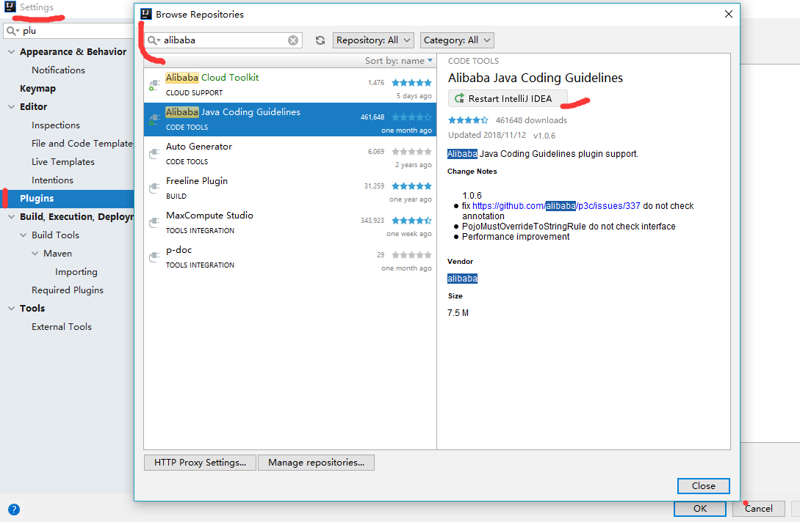
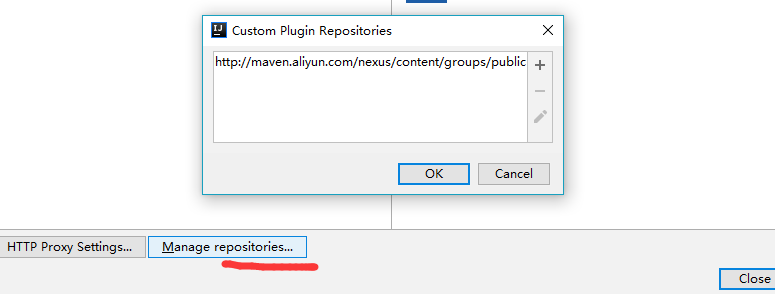
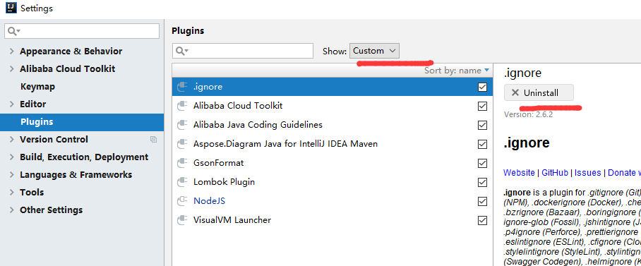
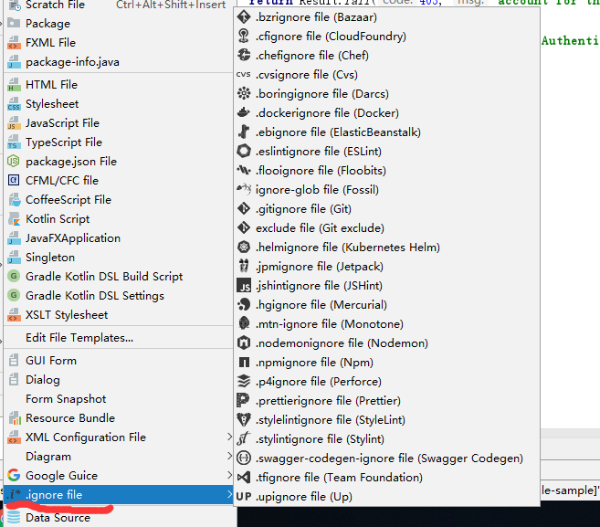
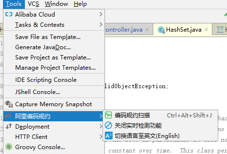
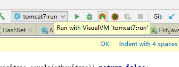

## plugin   ------    插件

		插件管理
			安装插件
			卸载插件
		常用插件

## 插件管理

### 安装插件

若插件查找不到，可以重新修改插件仓库地址

安装插件后，需要重新启动Idea工具

### 卸载插件

## 常用插件
|插件名称|插件功能描述|
|-|-|
|.ignore|针对不同的开发语言和工具，来快速生成Git的ignore文件模版 |
|Alibaba Java Coding Guidelines |Java开发规范|
|VisualVM Launcher|本地调试JVM性能情况|
|GsonFormat |使用JSON数据，生成视图类|
|Lombok Plugin|简化实体创建语法|
|Alibaba Cloud Toolkit |阿里云开发套件|
|Aspose.Diagram Java for IntelliJ IDEA Maven |生成图表|

### .ignore 使用

file -> .ignore file

### Alibaba Java Coding Guidelines

### VisualVM Launcher

